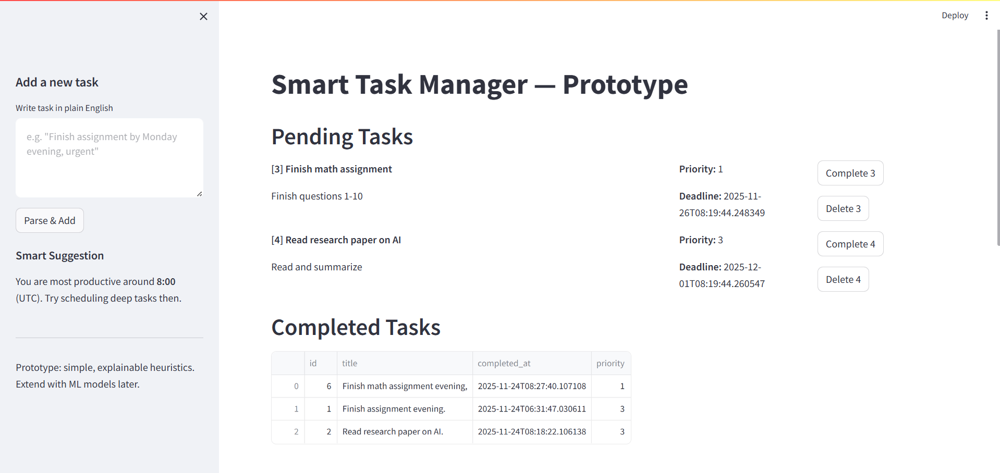
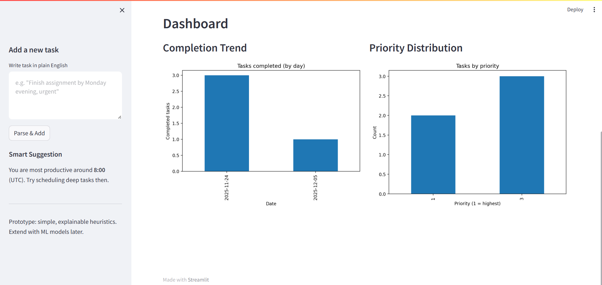

# PlanSmart AI: Highlights intelligent task understanding and decision-making.

## Overview

The **PlanSmart AI** is a Python-based application designed to make task management **simpler, smarter, and more efficient**. Unlike traditional task apps, this system allows users to **add tasks in plain English**, automatically extracting deadlines, priorities, and subtasks using **lightweight NLP and AI features**. The app also tracks user behavior to provide **smart priority suggestions and productivity insights**.

## Dashboard UI



**Key Features:**

* Add tasks in natural language (e.g., “Finish assignment by Monday, urgent”)
* Automatic extraction of:

  * Task title
  * Deadline
  * Priority
  * Subtasks
* Adaptive AI suggestions for task priority based on user behavior
* Productivity insights (best time of day to complete tasks)
* Task dashboard with:

  * Completion trends
  * Priority distribution

---

## Table of Contents

* [Installation](#installation)
* [Project Structure](#project-structure)
* [Usage](#usage)
* [AI Features](#ai-features)
* [Future Improvements](#future-improvements)
* [License](#license)

---

## Installation

1. **Clone the repository**

```bash
git clone https://github.com/mdjisan1/PlanSmart-AI-Highlights-intelligent-task-understanding-and-decision-making..git
cd PlanSmart AI: Highlights intelligent task understanding and decision-making.
```

2. **Create a virtual environment**

```bash
python -m venv venv
```

3. **Activate the virtual environment**

* On Windows:

```bash
venv\Scripts\activate
```

* On Mac/Linux:

```bash
source venv/bin/activate
```

4. **Install dependencies**

```bash
pip install -r requirements.txt
```

5. **Initialize the database**

```bash
python -c "from db import init_db; init_db()"
```

---

## Project Structure

```
smart-task-manager/
├─ app.py                # Streamlit UI (entrypoint)
├─ db.py                 # SQLite wrapper
├─ nlp_utils.py          # Parse natural language tasks
├─ ai_utils.py           # Priority suggestions & learning
├─ dashboard.py          # Dashboard plotting helpers
├─ sample_data.py        # Optional script to seed sample tasks
├─ requirements.txt      # Python dependencies
└─ README.md             # Project documentation
```

---

## Usage

1. **Start the application**

```bash
streamlit run app.py
```

2. **Add tasks**

* Use the sidebar to enter tasks in plain English, e.g.,
  `"Finish math assignment by Friday, urgent"`

3. **View tasks**

* Pending tasks appear in the main panel
* Complete or delete tasks using buttons

4. **Dashboard**

* Shows completion trends and priority distribution
* Sidebar provides productivity insights based on past behavior

---

## AI Features

| Feature                  | Description                                                                                           |
| ------------------------ | ----------------------------------------------------------------------------------------------------- |
| **Priority Suggestion**  | Combines NLP-extracted priority with adaptive bias learned from user task completions.                |
| **Productivity Pattern** | Tracks the hour of day when tasks are most frequently completed and suggests optimal task scheduling. |
| **Subtask Extraction**   | Detects keywords like "steps" or "then" to automatically break larger tasks into subtasks.            |
| **Adaptive Learning**    | Updates priority bias and productivity stats every time a task is marked complete.                    |

---

## Future Improvements

* Use a trained ML model for more accurate priority prediction
* Add user authentication to manage tasks for multiple users
* Integrate notifications and calendar syncing
* Enhance NLP using spaCy for better entity and date extraction
* Improve UI with advanced visualization libraries or a web frontend

---

## License

This project is open-source and free to use for educational purposes.

---

*Developed by [Md. Jisan Ahmed] — Prototype for Smart Task Manager project.*


